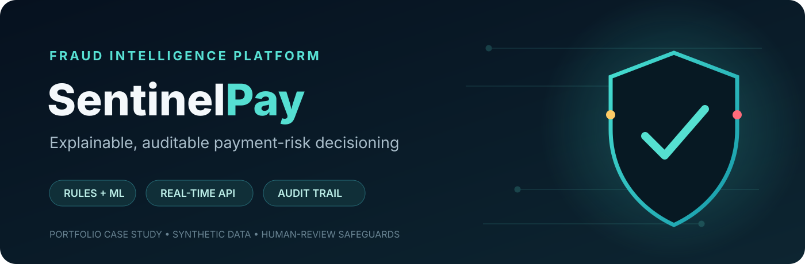
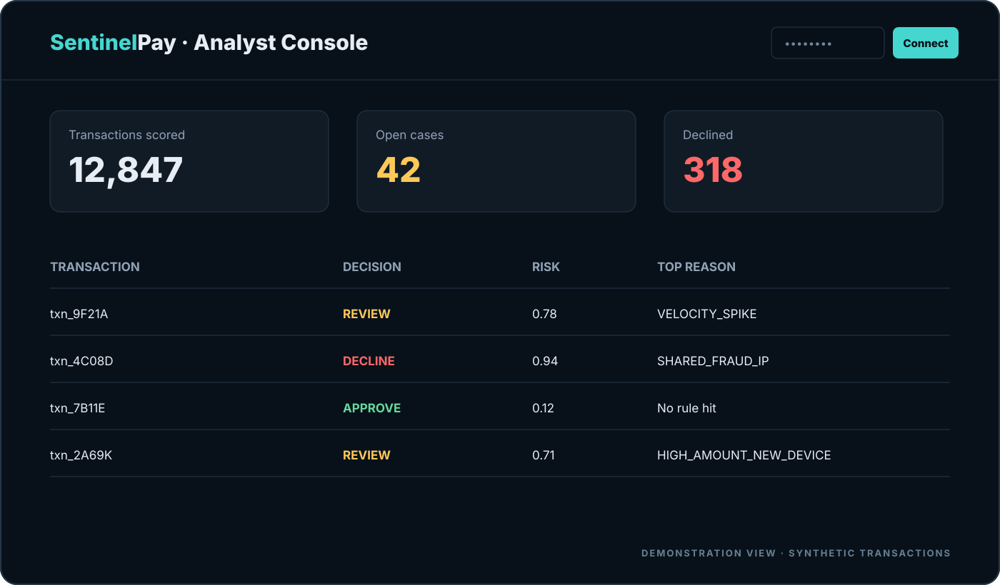
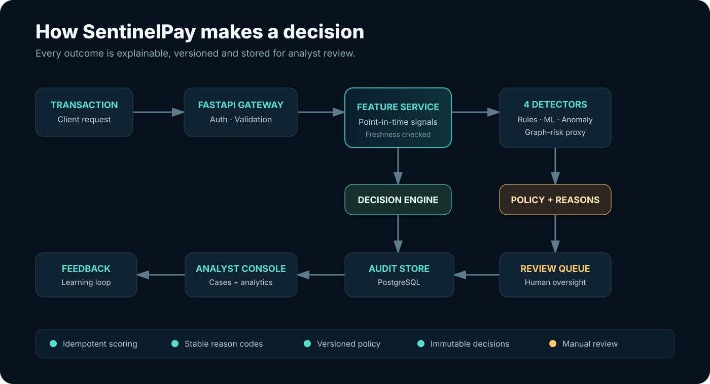
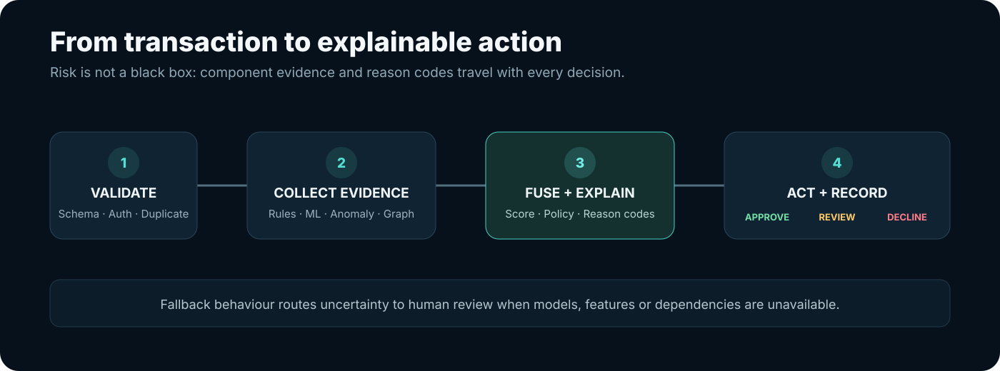
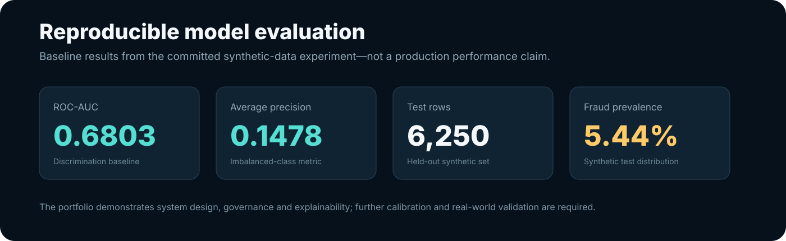

<p align="center">
  
</p>

<p align="center">
  <a href="https://github.com/sukhdev31/sentinelpay-/actions"></a>
  
  
  
  
</p>

SentinelPay is a production-style, explainable payment-fraud decisioning platform. It scores transactions through deterministic rules, supervised learning, anomaly detection and graph-risk signals; returns an actionable decision with reason codes; and preserves an immutable trail for analyst review.

> **Claim boundary:** the included model is trained and evaluated only on reproducible synthetic data. This repository demonstrates engineering, analytics and ML-system design—not bank-equivalent accuracy or readiness for real financial decisions without independent validation, governance and security review.

## Product demonstration

<p align="center">
  
</p>

The implemented analyst console presents transaction volume, open cases, declines, risk scores and stable reason codes. The image above uses labelled synthetic demonstration records; run the application to populate it through the real APIs.

## Business problem

Payment teams need to stop suspicious activity without turning every unusual transaction into customer friction. SentinelPay addresses that trade-off with three possible actions:

| Action | When it is used | Operational outcome |
|---|---|---|
| **Approve** | Evidence remains below policy thresholds | Transaction continues |
| **Review** | Evidence is uncertain, degraded or near threshold | Human analyst investigates |
| **Decline** | High-risk evidence crosses the decline policy | Transaction is stopped and recorded |

## How it works

<p align="center">
  
</p>

<p align="center">
  
</p>

Each decision retains the relevant code, model, feature, rule-set, policy and schema versions. If a model or dependency is unavailable, explicit fallback behaviour routes uncertainty to review instead of silently pretending that the system is healthy.

## What is implemented

- FastAPI scoring, health, readiness, metrics and case-management APIs
- Strict transaction validation, idempotency and API-key protection
- Eight explainable fraud rules and a versioned decision policy
- Reproducible synthetic-data generation
- Random-forest supervised model and isolation-forest anomaly model
- Graph-risk proxy using shared devices and confirmed-fraud IP signals
- PostgreSQL transaction, decision and review-case audit trail
- Redis connectivity for the online feature/cache boundary
- Responsive analyst console served at `/`
- Alembic migrations, Docker Compose, CI, tests, typing, linting and runbooks

## Evaluation snapshot

<p align="center">
  
</p>

These values are read from [`artifacts/fraud_model.metrics.json`](artifacts/fraud_model.metrics.json). They establish a transparent baseline; threshold selection, calibration, drift monitoring and validation on representative data remain necessary before real-world use.

## Technology

| Layer | Technology | Responsibility |
|---|---|---|
| API | FastAPI, Pydantic | Contracts, validation and orchestration |
| Decisioning | Python services | Rules, signal fusion and reason codes |
| Machine learning | scikit-learn | Supervised and anomaly models |
| Persistence | PostgreSQL, SQLAlchemy, Alembic | Transactions, decisions and review cases |
| Online boundary | Redis | Feature/cache connectivity |
| Operations | Docker Compose, Prometheus metrics | Reproducible runtime and observability |
| Quality | Pytest, Ruff, mypy, GitHub Actions | Automated engineering controls |

## Quick start

Requirements: Python 3.12 and Docker with Compose.

```powershell
Copy-Item .env.example .env
python -m venv .venv
.venv\Scripts\Activate.ps1
python -m pip install -e ".[dev]"
python -m sentinelpay.ml.train --rows 25000
docker compose up --build -d
```

Open:

- Analyst console: <http://127.0.0.1:8000/>
- Interactive API documentation: <http://127.0.0.1:8000/docs>
- Readiness check: <http://127.0.0.1:8000/api/v1/ready>

Protected endpoints require the `X-API-Key` configured in `.env`.

## Example score request

```bash
curl -X POST http://127.0.0.1:8000/api/v1/score \
  -H "Content-Type: application/json" \
  -H "X-API-Key: local-development-key" \
  -d '{"transaction":{"transaction_id":"txn_demo_001","event_time":"2026-09-10T10:00:00Z","account_id":"acct_001","card_token":"card_001","merchant_id":"merchant_001","device_id":"device_001","ip_token":"ip_001","amount":"750.00","currency":"USD","country":"US","channel":"WEB","card_present":false,"authentication_result":"PASS"}}'
```

The `features` object is optional for cold-start demonstrations. In production, it should come from point-in-time online features; accepting supplied features preserves simulation and contract-test compatibility.

## ML workflow

```bash
python -m sentinelpay.ml.synthetic --rows 25000
python -m sentinelpay.ml.train --rows 25000 --output artifacts/fraud_model.joblib
python -m sentinelpay.ml.evaluate --model artifacts/fraud_model.joblib --rows 10000
```

Binary model artifacts are excluded from Git and should be produced in CI/CD or stored in a governed model registry.

## Quality gate

```bash
python -m ruff format --check src tests migrations
python -m ruff check src tests migrations
python -m mypy src
python -m pytest --cov=sentinelpay --cov-report=term-missing
python -m alembic check
```

## Documentation

| Document | Purpose |
|---|---|
| [Product requirements](docs/01-product-requirements.md) | Users, outcomes, scope and constraints |
| [Fraud taxonomy](docs/02-fraud-taxonomy.md) | Fraud patterns and signals |
| [System architecture](docs/03-system-architecture.md) | Components, scoring sequence and failure behaviour |
| [Transaction contract](docs/04-transaction-data-contract.md) | Input fields and validation rules |
| [Acceptance criteria](docs/05-acceptance-criteria.md) | Functional and quality expectations |
| [Operations runbook](docs/06-operations-runbook.md) | Operating and recovery procedures |
| [Model card](docs/07-model-card.md) | Evaluation, intended use and limitations |
| [Security model](docs/08-security.md) | Privacy, threats and safeguards |

## Responsible-use boundary

- Use synthetic tokens—never PAN, CVV, passwords or real personal data.
- Keep final accountability with authorised human owners.
- Treat model scores as evidence inputs, not unquestionable truth.
- Monitor data quality, calibration, drift, false positives and subgroup outcomes.
- Complete legal, compliance, privacy and security reviews before any real deployment.

## Author

**Sukhdev Chhabra** — Computer Science undergraduate focused on fraud analytics, risk decisioning and business problem-solving.

## License

No licence has been selected yet. Add an appropriate licence before allowing reuse or redistribution.
