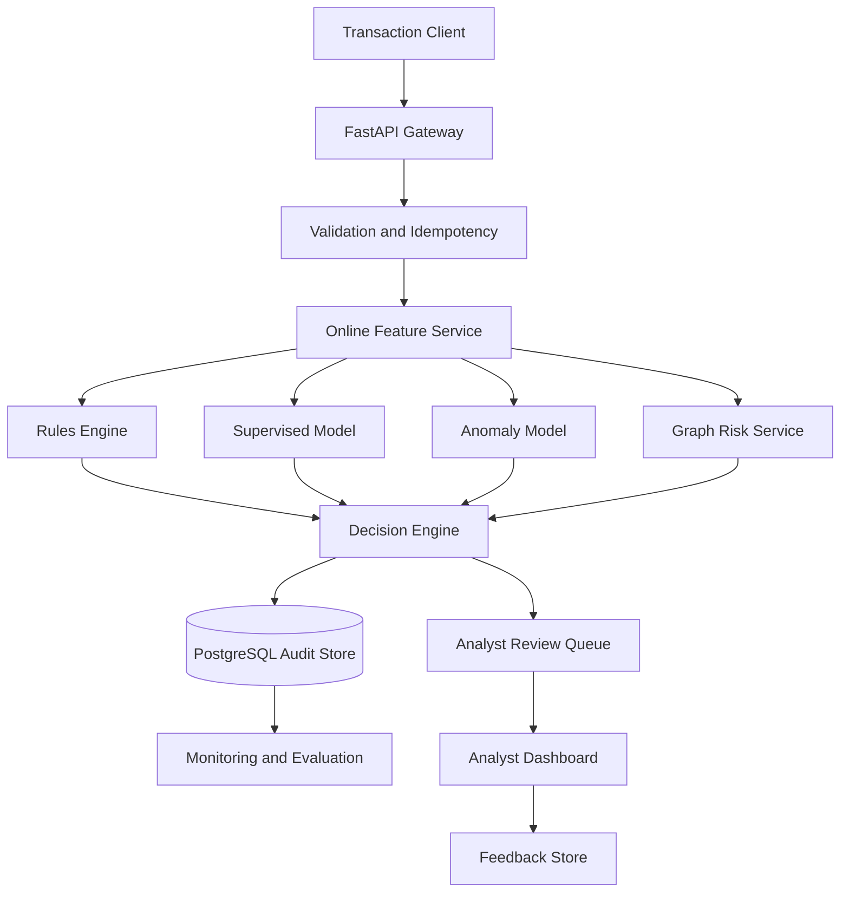
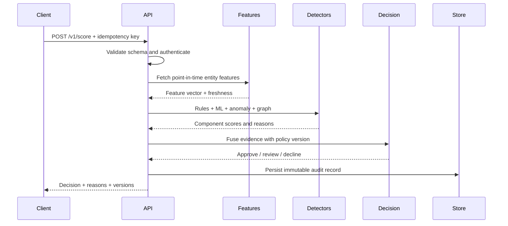

# System Architecture

## 1. Logical architecture

## 2. Deployment boundary

Version 1 uses deployable containers while keeping local execution affordable:

| Component | Responsibility | Initial technology |
|---|---|---|
| Scoring API | validation, orchestration, decision response | FastAPI/Pydantic |
| Rules package | versioned deterministic policies | Python/YAML |
| Model service | preprocessing and inference | scikit-learn + LightGBM/XGBoost candidate |
| Online feature cache | low-latency rolling/entity features | Redis |
| System of record | transactions, decisions, cases, feedback | PostgreSQL |
| Graph analysis | linked-entity feature computation | NetworkX offline; graph DB only if justified |
| Event transport | asynchronous audit/feature events | Redis Streams initially |
| Experiment tracking | parameters, artifacts, metrics, model lineage | MLflow |
| Model/data monitoring | data quality, drift, performance reports | Evidently-compatible pipeline |
| Analyst dashboard | operations and investigations | React/TypeScript |
| Public case-study site | recruiter-facing product narrative and demo | React/TypeScript |

Kafka, Feast, Neo4j, and Kubernetes are extension points, not résumé decoration. A dependency is introduced only when a measured requirement justifies its operational cost.

## 3. Online scoring sequence

## 4. Failure behaviour

| Failure | Required behaviour |
|---|---|
| Duplicate request | return original decision using idempotency key |
| Model unavailable | apply rules; route uncertain transactions to review |
| Feature cache unavailable | use explicitly defined safe defaults; mark degraded reason |
| Database write failure | do not pretend a durable decision exists; return retriable error |
| Invalid/stale features | fail validation or route to review according to policy |
| Monitoring unavailable | scoring continues; buffer operational event if possible |

## 5. Security and privacy boundary

- Use synthetic tokens, never PAN, CVV, passwords, or real personal data.
- Store only masked display values and irreversible entity tokens.
- Authenticate operational endpoints and enforce role-based analyst actions.
- Validate every external payload and apply request-size/rate limits.
- Put secrets in deployment configuration, never Git.
- Record append-only decision and analyst-action audit events.
- Exclude sensitive raw identifiers from logs.

## 6. Versioning contract

Every scored transaction stores:

- application code commit;
- model version;
- feature-definition version;
- rule-set version;
- decision-policy version;
- input schema version;
- scoring timestamp and feature freshness.
